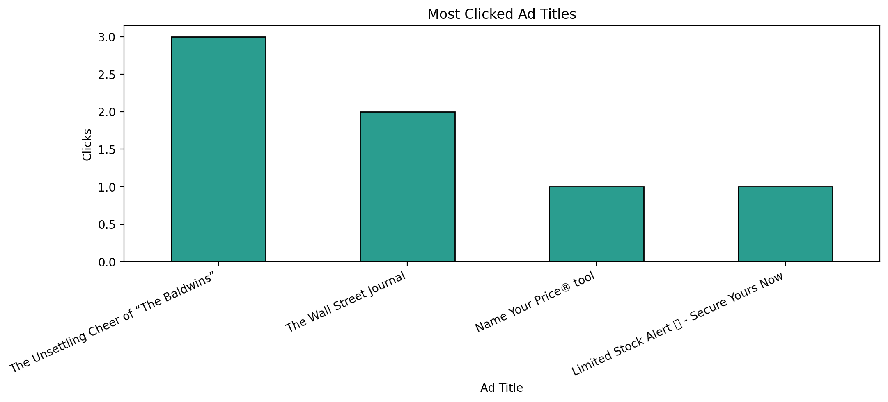

## Part 3: Show the Data

For this part, I continued exploring the Instagram JSON export and focused on the `ads_clicked.json` file.

I turned the ad click records into a pandas DataFrame, and then pulled out key fields from `label_values`, especially `Title`, `Action`, and `timestamp`.

Then, I built a bar chart of the ad titles I clicked most often.

What stood out to me:
- I clicked one ad title multiple times (`The Unsettling Cheer of "The Baldwins"`). I have abolutely no idea what this is. 
- `The Wall Street Journal` appeared more than once too. That seems normal for me.
- The other clicked ads were single events.

### Visualization

### Files/Code Used

- Notebook analysis and graph code: `Project01.ipynb`
- Data source: `data/my_data/ads_information/ads_and_topics/ads_clicked.json`
- Saved plot image: `imgs/ads_clicks_by_title.png`
